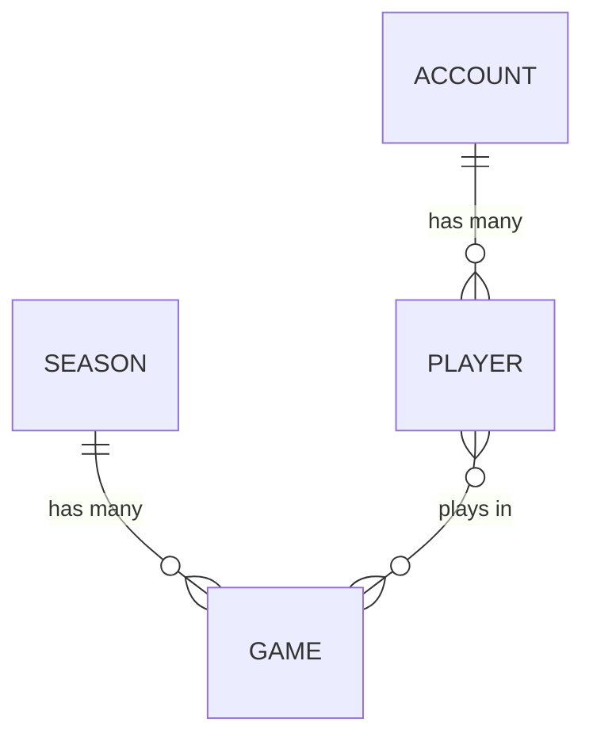

# stweak

Player account management for a theoretical online team PvP game.

stweak is the system of record for who a player is and what happened to them.
It owns accounts, the players attached to those accounts, the seasons the game
is divided into, and the games played within a season. It does not run matches
and it is not the game server; it is the book of record that sits behind one.

The project exists as much to demonstrate a way of building software as to
solve the problem. Every choice below is made deliberately, and is meant to be
read, questioned, and learned from. It is a research project for the author as
much as a potential example for others, and is being developed with the help
of AI as a way to see how well it copes with stringent goals and requirements.

Terms that may be unfamiliar, and terms used here in a particular sense, are
defined in the [glossary](#glossary).

## Contents

- [Project status](#project-status)
- [Architecture and practices](#architecture-and-practices)
- [Goal](#goal)
- [Domain](#domain)
- [Design decisions](#design-decisions)
- [License](#license)
- [Glossary](#glossary)

## Project status

Early. The guidelines and the domain model are being written down first, before
any code exists, so that the code has something to be held to.

## Architecture and practices

- **Written in Ruby.** Because it is an easy language to read.
- **Event sourcing wherever possible.** Changes are recorded as events rather
  than as updates to stored state.
- **Hexagonal architecture.** The domain sits at the centre and knows nothing
  about the technology around it.
- **A projection system.** Read models are built from the event log by a
  dedicated projection system, which is part of the project rather than
  something bolted on around it.
- **CQRS.** Writes go through commands and aggregates, reads come from
  projections, and the two are kept apart; see the [CQRS](#cqrs) design
  decision.
- **Heavily unit tested, with mutation testing via mutant.** Line coverage is
  not the target. Mutation score is, because it measures whether the tests
  actually constrain behaviour.
- **Statically typed with Sorbet.** Signatures on everything the domain
  exposes, checked before the tests run.
- **Explicit requires, no autoloading.** Every dependency is loaded where it is
  used and nowhere else.
- **Heavily documented.** Both the what and the why, on the assumption that a
  reader arrives with no context.

These are not aspirations to be traded away when they become awkward. They are
the point of the project, and the awkward cases are the interesting ones.

## Goal

Be as close to a perfect example project as possible for the practices defined
above.

"Perfect" does not mean feature complete or production hardened. It means that
someone reading this repository should be able to see each practice applied
honestly and consistently, without the compromises and half measures that
usually creep into a codebase under deadline. Where a practice is inconvenient,
the inconvenience should be worked through rather than skipped.

Beyond the practices named above, the project aims to follow good development
practice generally: the everyday habits that are not worth listing
individually but are worth getting right, from naming and error handling to
commit history and dependency management.

## Domain

The vocabulary below is the shared language of the project. It is worth using
these terms exactly, in code and in conversation, rather than inventing
synonyms for them.

- **Account** - a single registered person, and potentially a paying one. An
  Account can have many Players. The person behind an Account does not
  necessarily play the game themselves; think of a parent paying while their
  children play.
- **Player** - an individual player of the game, with their own login. A
  Player has many Games, and a Game has many Players.
- **Season** - an arbitrary grouping of games, usually time-based but not
  always. Player stats typically reset when a new season starts, though a
  little may carry forward, such as a skill level.
- **Game** - a single game in which teams of people play, and the outcome of
  that game. It is best thought of as a game result: it records what happened,
  not a fixture to be played. Games are created dynamically, by matchmaking, as
  is typical of online games, rather than scheduled in advance the way
  traditional sports fixtures are.
- **Team** - not a persistent thing. A team is simply the collection of Players
  on one side within a Game, and has no existence outside it.

Separating Account from Player is what makes the rest of the model work. The
Account is the person and the commercial relationship with them; a Player is a
presence in the game. One Account may hold several Players, and what is true of
one Player is not automatically true of the others.

The Player to Game relationship is what makes a Player's record season-scoped.
A Player reaches a Season only by way of the Games they played in, so the
question "how did this Player do in that Season?" is answered by their Games,
never by a number stored against them.

### Events, not state

There are no accrued stats. What is stored are events: game outcomes, and
Account and Player CRUD actions. Stats are a projection over those events.

This inverts the usual expectation, so it is worth being blunt about. The
system does not hold a win count that gets incremented. It holds the record of
every game that was played, and a win count is one of many answers that can be
derived from that record. History is never lost, any figure can be traced back
to the events that produced it, and a question nobody thought to ask at the
start can still be answered later by replaying what has always been there.

### Account and Player actions

Both Accounts and Players have the typical CRUD actions:

- **Create** - registering an Account, or adding a Player to one.
- **Read** - retrieving an Account or Player as it currently stands.
- **Update** - changing what is held about them, such as a display name or
  contact details.
- **Delete** - removing an Account or Player from active use.

Delete is worth pausing on, because in a system that never rewrites its log it
cannot mean what it usually means. Deleting is itself an event: the record of
the deletion joins everything that came before it, and what is deleted is the
thing's presence in the game rather than its history. Erasing the history is a
separate concern, handled by [crypto-shredding](#gdpr).

They also have the admin and moderation actions that running a game demands:

- **Warnings** - recorded against the Player, and usually the step before
  anything heavier.
- **Temporary bans** - suspension from play for a fixed period.
- **Permanent bans** - suspension with no end.
- **Communication restrictions** - muting chat or voice while leaving play
  itself alone, since most reports concern what was said rather than what was
  done.
- **Matchmaking restrictions** - keeping a Player out of ranked or competitive
  queues, whether as a penalty or to protect other players from them.
- **Forced renames** - clearing a display name that should not have been
  allowed.
- **Stat or rank adjustments** - undoing the effect of cheating or of a bug,
  where leaving the result standing would be unfair to everyone else.
- **Reversals** - lifting any of the above, whether on appeal or because it was
  applied in error.

That last one matters more than its size suggests. Moderation decisions get
overturned, and a system that can only apply penalties and not lift them is
incomplete. Under event sourcing a reversal is simply another event, so the
sequence of penalty, appeal and reversal survives intact rather than the
penalty quietly disappearing.

Moderation is a first-class part of the domain rather than an afterthought
bolted on later. It is also a natural outcome of event sourcing: the history of
what was done to an account, by whom, and in what order is exactly the record a
moderation system needs, and it comes directly from how everything else is
stored rather than from a separate audit log that has to be kept in step.

### GDPR

GDPR is supported via crypto-shredding. Encryption keys live in a table that is
**not** event sourced. Compliance (the right to erasure) is handled by deleting
the encryption key, which renders the associated events unreadable. The event
stream itself is never mutated.

Keys are held **per entity that owns personal data**: an Account has its own
key, and each Player will have one of their own. Erasure is therefore
granular: a single Player can be erased without touching the others on the
same Account, and erasing an Account means deleting the keys of every Player
it holds *and* its own key.

This resolves what looks at first like a direct contradiction. An event log is
append-only and never rewritten, while the right to erasure requires that
personal data can be destroyed on request. Crypto-shredding satisfies both by
moving the deletion somewhere else: personal data is written encrypted, the key
lives in mutable storage outside the log, and erasing the key erases the data
in every sense that matters while leaving the append-only guarantee intact.

## Design decisions

Choices about how the domain above is built and stored. Each is recorded with
the reasoning behind it, because the reasoning is what has to be revisited if
the decision ever stops holding.

### Domain first, adapters after

Work starts with the domain code, for the same reason the domain is described
before this section. It is the part the project is actually about, and starting
there lets the technology around it wait until the domain has enough shape to
say what it needs.

For each collaborator the domain relies on, the intention is to end up with at
least two implementations: a memory-backed or otherwise very simple one,
suitable for local work and end-to-end testing, and at least one built on a
major, well known technology, ideally two. Having more than one is the point
rather than a side effect. A collaborator with a single implementation behind
it proves nothing, because nothing has been shown to be interchangeable. One
with several, swapped freely without the domain noticing, is hexagonal
architecture doing the job it was chosen for.

The same applies to whatever calls the domain. There should be something local,
and something network callable. If the domain is genuinely independent of what
drives it, driving it two different ways should require no change to it at all.

There will also be a data generator, a caller that wraps the domain and
produces plausible events in volume. It serves as a way to stress test the
system, and as a source of realistic data to build projections against before
any real traffic exists.

### CQRS

CQRS (command query responsibility segregation) keeps the path that changes
things separate from the path that reads them. This project is built around
that split rather than adopting it as an extra layer, because the design above
already points at it: an event log is a poor thing to query directly, so writes
and reads were never going to be the same shape. CQRS makes that difference
explicit and deliberate.

The write path is commands. A command is an intention, such as "create this
Account" or "ban this Player", handled against an aggregate that checks it
against current state and emits events. This path is shaped by the rules, and
is deliberately not shaped for answering questions: an aggregate is rebuilt
from its own stream so that it can enforce consistency, and reaching into one
for a read would be fighting that design.

The read path is projections. Every question the system answers, such as what
an account looks like now or how many games a player won last season, is
answered by a read model built from the event log, never by poking at aggregate
state. Read models are shaped by the questions people want to ask, which is why
they can be rebuilt and replaced as those questions change.

In practice the domain defines commands, events and projections and says
nothing about how any of them are delivered. The two sides are developed and
tested separately, and joined only by the event log between them: nothing on
the read side knows how a write happens, and nothing on the write side knows
how its events will eventually be read.

### Event versioning

Events carry a version number, and old versions are upcast on read. When an
event's shape changes, what is already in the log stays exactly as it was
written; the new version is given a new number, and reading an older one
translates it into the current shape before anything else sees it.

The alternative, rewriting history to match the code, would break the one
guarantee the log is there to provide. This way the log stays append-only and
the rest of the system only ever deals with events in their current form.

### Concurrency

Writes use optimistic concurrency on the stream. A command is handled against
an aggregate rebuilt to a known position in its stream, and the resulting
events are only accepted if the stream is still at that position. If something
else has appended in the meantime, the write is rejected rather than applied on
top of state that has since moved.

Nothing is locked, which is the appeal: the common case, where two commands
touch different aggregates, costs nothing at all, and the rare case of genuine
contention is caught at the point it would do damage.

### Explicit requires, no autoloading

Every gem dependency is declared `require: false`, and every file requires
exactly what it uses, where it uses it. Nothing is autoloaded, and no framework
populates the namespace at boot.

This is a departure from normal Ruby and Rails convention, and it comes from
experience debugging applications rather than from theory. When loading is
implicit, "where is this class actually coming from?" is a question the source
cannot answer, and it tends to be asked at the worst possible moment. Explicit
requires make the dependency graph readable from the files themselves: what a
file needs is written at the top of it, and what the project needs is the union
of those lines rather than a convention held in someone's head.

The cost is real and worth stating. There is more ceremony, requires have to be
maintained by hand, and a missing one fails at load rather than being papered
over. That is the trade being made deliberately: a slightly noisier source in
exchange for a system whose loading can be reasoned about.

It also sits well with the rest of the design. A domain that knows nothing
about the technology around it should not be quietly handed that technology by
a framework it never asked about.

### require_relative for files we own

Files the project owns are loaded with `require_relative`; `require` is
reserved for gems and the standard library. A project file is reached by the
relative path written at the top of the file that uses it, never by a name
resolved through the load path.

The reason is that `$LOAD_PATH` is a shared, global resource. Every directory
added to it so that `require 'stweak/...'` resolves stays there for the whole
process, and the more of the project that is loadable by bare name, the closer
it comes to the implicit, unreadable loading this project already rejects.
Keeping our own files off the load path means the only way to reach one is the
explicit relative path in the file that uses it.

The cost is that moving a file to a new directory means fixing the relative
paths that point at it, a small, mechanical price for keeping the load path to
what it is actually for: the gems and the standard library.

### Static typing with Sorbet

The domain carries Sorbet signatures, checked by `srb tc` before the tests run.

A domain built from value objects, commands and events is largely a set of
claims about shape: this identifier is a UUID, this event carries exactly these
fields, this method returns a Player or raises. Those claims can be written
down and checked rather than left implicit and tested for one case at a time.
Static typing also complements mutation testing: the type checker eliminates a
whole category of mutation that would otherwise need a test to kill, leaving
the test suite to concentrate on behaviour rather than on shape.

The cost is sigils and signatures in the source, which some readers find
noisy, and gem RBIs that have to be regenerated as dependencies change. Both
seem a fair price for a project whose stated goal is being checkable.

### Types over primitives

The domain prefers a named type to a bare primitive wherever the value means
more than its class. An account id is an `AccountId`, not a `String`; a season
is a `Season`, not a number. The type system then carries meaning: a method
that accepts an `AccountId` cannot be handed a username, and a signature says
what a value is for without a reader having to guess.

This is static typing taken one step further. A signature pins down shape;
choosing the right type pins down meaning, and lets the checker catch the
confusion a bare string would hide. The cost is more types and more ceremony,
which is the same trade the project already makes for static typing, and it is
accepted for the same reason: the check happens before the code runs.

### Errors are part of the contract

An API's errors are part of its contract, named and documented like its return
values. A method that can fail says what it raises, and a caller can depend on
that list rather than discovering failures by reading the body. Errors are
reserved for situations that are genuinely errors — something that should not
have happened, given the rules — not for steering control flow.

This is the sibling of static typing. A signature describes what a method takes
and returns, but a contract is incomplete without what can go wrong. Naming an
error for what it means, an account that already exists or a key that is not
there, is the same explicitness the project applies everywhere else: the
behaviour of a method is declared, not discovered.

### Objects validate themselves at construction

The domain's value objects, commands and events validate themselves when they
are built. An object that cannot be made valid does not come into existence:
its constructor raises rather than returning a potentially invalid instance
that might later be handed to a service.

The reason is blunt. If a command can be constructed in a state its handler
then has to check for, that invalid state will eventually be constructed and
passed around, and the failure will surface far from where the mistake was
made. Making construction the only way to create an object, and refusing
invalid input at that point, means an invalid object is not merely unlikely.
It is unrepresentable.

This is the same kind of claim the project makes elsewhere, moved earlier in
time. Sorbet signatures pin down the shape of an object before the program
runs, and constructor validation pins down whether that shape is a legal one at
the moment it is filled in. Between the two, by the time a handler receives a
command, both its type and the validity of its contents are already settled.

None of this replaces the checks an aggregate makes against current state.
Whether a command is well-formed is one question, and whether it is allowed,
such as whether that account name is taken or that player may be banned, is
another, answered at handling time against the aggregate. This decision
guarantees that the first question never goes unanswered, because a broken
object cannot be built.

### Encryption at the event-store boundary

The event class declares which fields are personal data — for example,
`AccountCreated.pii_fields` returns `[:name]`. That declaration is a business
rule, a statement of what the law requires to be erasable, so it lives in the
domain. The cryptography that honours it lives in an adapter: an
`EncryptingEventStore` decorates a raw event store, encrypting every PII field
on append and decrypting it back on read. The domain emits and receives the
plaintext name and never knows what AES-256-GCM is.

The cipher is AES-256-GCM with a random 256-bit key and a fresh nonce per
encryption; the nonce and authentication tag are stored alongside the
ciphertext, so each encrypted value is self-contained. Keys are created
implicitly on first use, held per entity that owns personal data, and stored in
a key store outside the event log — the crypto-shredding design from the
[GDPR](#gdpr) section. An entity is an aggregate class and an id: keys are
qualified with the owner's class, so an Account and a Player that happen to
share an id never share a key.

### Password hashing happens in the domain, through a port

`CreateAccount` carries the raw password, and the handler hashes it through a
`PasswordHasher` port before the aggregate ever sees it. The raw password never
reaches the event log, and a caller — a future CLI or HTTP adapter — never
touches hashing at all.

The implementation is PBKDF2-HMAC-SHA256 with a per-password random salt, using
only the stdlib. The stored value is self-describing
(`pbkdf2-sha256$<iterations>$<salt>$<hash>`), so verification can be added
later without changing what is stored. The method is named `digest` rather than
`hash` because `hash` collides with `Kernel#hash`, which would make an
implementor unusable as a hash key.

### The handler is an application service

`CreateAccountHandler` lives in the domain layer, not in a driving adapter. It
hashes the command's password, drives the aggregate, and appends to the event
store; the command validated itself when it was built. It is deliberately
built to be driven two different ways — something local, something network
callable — without any change to the domain, per the [domain first, adapters
after](#domain-first-adapters-after) decision.

### Observability stays out of the domain

The domain does not log, and it does not emit metrics. Observability is a
concern of the technology around the domain, not of the rules themselves, and
putting it in the domain would leak an infrastructure concern into the very
part of the system that is meant to stay pure. When telemetry is genuinely
needed, it is added from outside: a module prepended onto the domain class, or
a wrapper around it, that logs and times and counts while the wrapped class
stays exactly as it was.

This is the same boundary as encryption. There, the domain declares which
fields are personal data and an adapter honours it; here, the domain does its
work and a decorator records it. The domain is left plain, and the
instrumentation can be swapped in and out without the domain knowing.

### All datastores are in-memory for now

This phase ships no persistence. The event store, the key store behind it, and
the checkpoint store are all memory-backed, so nothing survives a restart. That
is accepted because nothing is persisted anyway: the event store is the only
record of accounts, and a durable key store would be guarding a log that is
itself lost on restart. The two-implementations rule above is therefore not yet
met for any collaborator; the durable implementations — the key store in
particular, which crypto-shredding's "delete the key" erasure will build on —
are the obvious next step.

### Property-based testing, as research

This one is not a settled decision, and should not be read as one.

Property-based testing states what should be true of all inputs and lets the
tooling search for a counterexample, rather than asserting one example at a
time. In principle it pairs well with what is already here: mutation testing
asks whether the tests pin behaviour down, and property tests generate the
cases nobody thought to write.

In practice the author has no experience with it at all. It is being tried
because it looks like a good fit, not because it is known to be one, and it may
turn out to be a poor match for this domain or simply more trouble than it is
worth. If that happens it will be removed and the reason recorded here. Treat
everything else in this document as decided and this as an open experiment.

## License

Copyright (C) 2026 Jeffrey Jones.

Released under the GNU Affero General Public License, version 3 or later. See
[LICENSE](LICENSE) for the full text. The AGPL is chosen deliberately: it
extends the GPL's obligations to software offered over a network, so a hosted
version of this project carries the same duty to share source as a distributed
one.

## Glossary

Keep this glossary updated. Whenever a technical term is introduced elsewhere
in this document or in the project that a reader may not know, define it here.

**Event sourcing** - state is not stored directly. Every change is recorded as
an immutable event appended to a log, and current state is derived by replaying
those events. The log is the source of truth, so nothing is overwritten or
deleted; a correction is a new event, not an edit. This gives a complete audit
trail for free, and lets new questions be asked of old data by replaying
history through a new interpretation of it.

**Event stream** - the ordered sequence of events belonging to one thing, for
example a single Account. Replaying a stream from the beginning reconstructs
that thing's current state.

**Command** - a request for something to happen, such as "ban this Player".
Commands are distinct from events in both tense and status: a command is an
intention that may be rejected, an event is a fact that already happened and
cannot be argued with. Handling a command means validating it against current
state and, if it holds up, appending one or more events.

**Aggregate** - the unit that commands are addressed to and that guards the
rules. It is rebuilt by replaying its own event stream, decides whether a
command is allowed, and emits the resulting events. It is also the boundary of
consistency: rules can be enforced within one aggregate, but anything spanning
several of them has to be handled another way.

**Checkpoint** - a cached copy of an aggregate's state at a point in its
stream. The write side writes one every 100 events, so a command handler can
resume an aggregate from its latest checkpoint plus only the events after it,
rather than by replaying the whole stream. Checkpoints are derived data: the
event log remains the source of truth, and any checkpoint can be discarded and
rebuilt. They are a write-side concern and have nothing to do with projections.

**Optimistic concurrency** - allowing concurrent work to proceed without
locking, on the assumption that conflicts are rare, and detecting them at the
moment of writing rather than preventing them in advance. Here that means an
append carries the stream position it was based on, and is refused if the
stream has moved on since.

**Upcasting** - translating an old event into the shape the code now expects,
at the point it is read. Events are immutable and the log is permanent, so when
a new field is added or a name changes, the events already written cannot be
rewritten to match. Upcasting is how the past is allowed to keep its own shape
while the present moves on.

**Read model** - any data structure shaped for answering questions rather than
for enforcing rules. Read models are built from events and are never written to
directly by users of the system.

**Projection** - a read model built by replaying events into a shape convenient
for querying. Projections are derived and disposable: they can be thrown away
and rebuilt from the event log at any time, and several different projections
can be built from the same events. Stats in stweak are a projection.

**Projection system** - the machinery that builds and maintains projections:
it reads events from the log, feeds them to each projection in order, keeps
track of how far each one has consumed, and rebuilds a projection from the
beginning when its shape changes or it needs to be replaced. It is what turns
a projection from a one-off script into something that stays current and can
be recreated on demand.

**Idempotency** - the property that doing something twice has the same effect
as doing it once. It matters here because events may be delivered to a
projection more than once after a crash or a retry, and a projection that
counts a game twice in that situation is simply wrong.

**CQRS** (command query responsibility segregation) - separating the path that
changes things from the path that reads them, so each can be designed for its
own job. Writes go through commands and aggregates and are shaped by the rules;
reads come from projections and are shaped by the questions being asked. Event
sourcing does not require CQRS, but the two fit together naturally, because an
event log makes a poor thing to query directly.

**Hexagonal architecture** (ports and adapters) - the domain logic sits in the
middle and knows nothing about the outside world. It defines *ports*, the
interfaces describing what it needs or offers, and *adapters* implement those
ports against real technology such as a database, an HTTP framework, or a
message bus. Dependencies point inward only, so the domain can be exercised in
tests with in-memory adapters, and infrastructure choices can change without
touching business rules.

**Collaborator** - anything the domain works with but is not itself: an event
store, a clock, a source of randomness. The domain names what it needs from a
collaborator and nothing more, which is what allows the same need to be met by
several different implementations.

**Driving and driven adapters** - the two sides of a hexagon. A driving adapter
calls the domain: a CLI, an HTTP API, a test harness. A driven adapter is
called by it: an event store, a queue, a clock. The distinction matters because
it is the direction of the call, not the technology, that decides which is
which.

**Mutation testing** - a way of testing the tests. The tool, here mutant, makes
small changes to the source code such as flipping a condition, removing a call,
or altering a constant, then re-runs the suite. If the tests still pass, that
mutation "survived", meaning the behaviour it changed was never actually
verified. It measures whether a suite genuinely pins down behaviour, which line
coverage does not.

**Property-based testing** - describing a property that should hold for every
valid input, then letting the tool generate inputs to try to falsify it. Where
an example-based test says "3 and 4 give 7", a property says "adding two
positive numbers gives something larger than either", and the tool goes looking
for a case where that fails. When it finds one it shrinks it to the smallest
input that still breaks, which is usually the clearest description of the bug
you will get.

**Static typing** - checking claims about the shape of data before the program
runs, rather than discovering at runtime that a method received something it
could not handle. In Ruby this is a deliberate addition rather than a property
of the language.

**Sigil** - the `# typed:` comment at the top of a Ruby file that tells Sorbet
how strictly to check it, from `ignore` through `false`, `true` and `strict` to
`strong`. Each level demands more of the file: at `strict`, every method must
have a signature and every constant a declared type.

**RBI** (Ruby interface file) - a file describing the types of code Sorbet
cannot see for itself, most often a gem's public API. Generated by tapioca and
kept under `sorbet/rbi/`, they are build artefacts of a sort: regenerated when
dependencies change rather than edited by hand.

**Crypto-shredding** - deleting data that cannot be deleted, by encrypting it
and then destroying the key. The encrypted records remain in place but become
permanently unreadable, which lets an append-only event log coexist with a
legal obligation to erase personal data.
