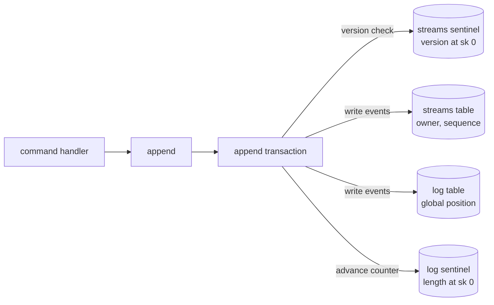
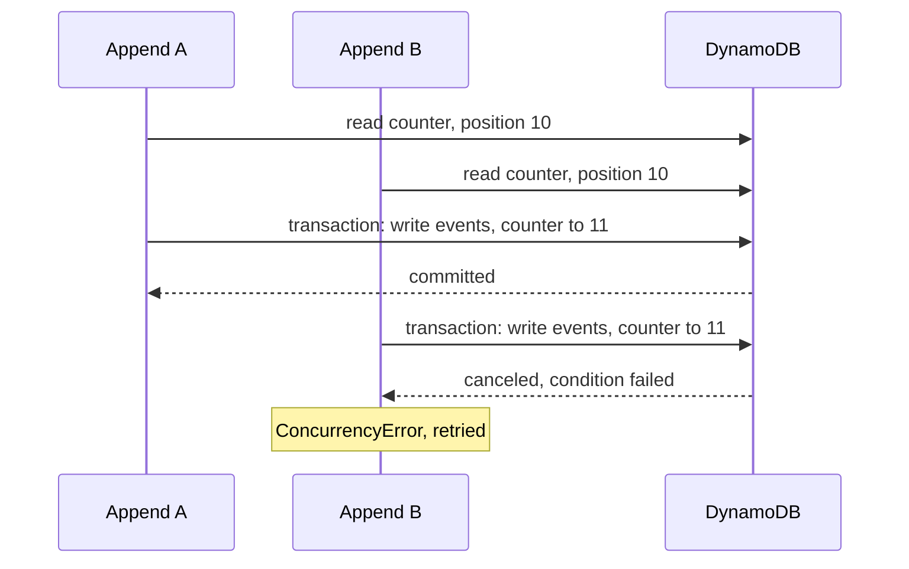
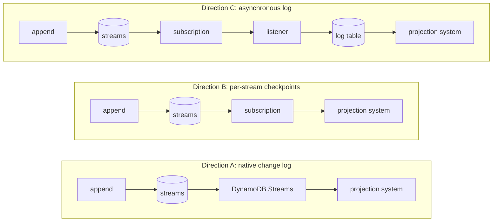
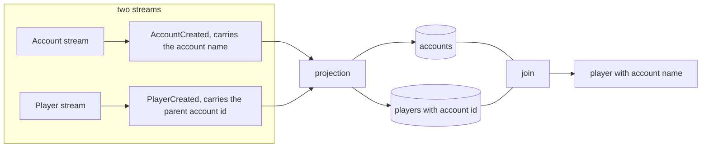
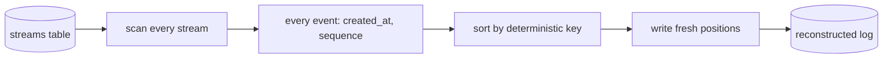

<!-- markdownlint-disable MD034 -->

# Event Store Ordering: Central Log versus Per-Stream Storage

## Abstract

Should the stweak event store maintain a central, globally ordered event log
in addition to per-stream event storage? A central log assigns every event a
single position in append order, which simplifies projection resume,
deduplication and deterministic
replay, but it does so at the cost of serializing every write through one
counter. On DynamoDB that counter is capable of at most a few hundred
appends per second. The assessment weighs this cost against the ordering
guarantees that per-stream storage provides, reviews the principal
alternatives — a native change log, per-stream checkpointing, and
asynchronous log maintenance — and examines the recovery and reversibility
implications of each. It concludes that the only unique service the central
log provides, a global commit order, is not required by the projections
this domain defines, and that per-stream storage with order-tolerant
projections is the simpler and more scalable direction. The choice is
reversible: a global log can be reconstructed from the streams at low cost
if a consumer for one should appear.

## 1. Introduction

stweak is an event-sourced system: every change is recorded as an immutable
event appended to a stream, and state is derived by replaying those events.
The central-log arrangement keeps two tables. The streams table holds each
aggregate's events in per-stream sequence order. The log table holds every
event in the system in a single global append order, with positions handed
out by a counter sentinel. Section 5 assesses arrangements that do without
the log table.

The question is whether a central, globally ordered log should be maintained
at all, or whether the streams table alone is sufficient. The question is
assessed against the ordering requirements of the projections the domain
defines, the throughput characteristics of DynamoDB, the practices
documented in the event-sourcing literature, and the recovery properties
each arrangement provides.

## 2. The central-log arrangement

### 2.1 The two tables

The streams table is keyed by owner and sequence. Its partition key is the
aggregate class and id, its sort key is the event's sequence number, and a
version sentinel at sort key zero enforces optimistic concurrency: an
append is accepted only if the stream is still at the version it was built
on. The log table is keyed by a constant partition key, its sort key being
the global position, and a counter sentinel at sort key zero records the
length of the log.

Each event carries two timestamps: `occurred_at`, the time the fact
happened, set by the handler; and `created_at`, the time the event was
committed, stamped by the store at append. This assessment assumes
`created_at` is in use.

### 2.2 The append transaction

Every append is a single DynamoDB transaction. It checks the stream's
version, writes the events to both tables, and advances the log counter.
Because the counter is a single item, appends to different streams contend
on it. Two concurrent appends read the same position; only one counter
update can win, and the other is rejected with a `ConcurrencyError` and
must be retried by the caller.

The append writes both tables and both sentinels in one transaction:

### 2.3 The single-writer bottleneck

The consequence is that every write in the system serializes on one item,
no matter how many streams it touches. This is the single-writer
bottleneck, and it is the motivation for this assessment.

Two concurrent appends contend on the counter; only one advances it:

## 3. The role and cost of the global log

### 3.1 What the global log provides

The global log serves a single consumer: the projection system. Aggregates
read only their own stream, so the write path never uses the global
position. The projection system uses it for three purposes:

- **resume** — reading everything appended since the last checkpoint;
- **deduplication** — skipping re-delivered events by position;
- **deterministic replay** — folding events into projections from one
  ordered feed.

### 3.2 Total order versus single writer

A strict total order over all events requires a single allocator, and a
single allocator is a single writer. This is the same trade-off Kafka
makes: order is guaranteed within a partition and only there; global order
means a single partition and a single producer. Every alternative in this
document chooses one side of that trade. The question is not whether both
can be had, but whether the total order is worth the writer.

### 3.3 The cost to the write path

The global position is an implementation convenience for the projection
system that the entire write path pays for. On DynamoDB the cost is
concrete and is quantified in section 4.3.

## 4. Related work and practice

### 4.1 Ordering guarantees are per-aggregate

The founding text of CQRS states the ordering guarantee explicitly. Greg
Young:

> "Order is only assured per a handler within an aggregate root boundary.
> There is no assurance of order between handlers or between aggregates.
> Trying to provide those things leads to the dark side."

The EventFlow FAQ observes that global sequence numbers "don't really make
sense from a domain perspective": they are an infrastructure convenience,
not a domain need. The broader literature agrees that global ordering
across entities is usually unnecessary and harms scalability; ordering is
per-aggregate or per-partition.

### 4.2 A global log is a documented bottleneck

Sources that discuss a single ordered log converge on the same limit.
Ecotone, describing a global tracking projection: "only one worker can
advance the cursor at a time. Extra workers create lock contention, not
throughput." Jet encountered the limit with EventStoreDB — "the log isn't
partitioned, and the single reader thread becomes a bottleneck" — and
introduced Kafka as a distribution medium. SoftwareMill lists global
sequencing as a known scaling limit.

### 4.3 DynamoDB-specific constraints

Three constraints stack on a single-partition log. The numbers below were
verified against the AWS documentation.

#### 4.3.1 Partition ceiling

DynamoDB caps each partition at roughly 1,000 write units per second, and a
single logical partition key range holds all of it. AWS's own guidance for
an event store is the *streams* shape — aggregate id as partition key,
sequence as sort key, optimistic locking by condition expression — which
spreads writes across partitions; the log table is the opposite of that
guidance. Every event in the log table, counter included, shares the one
constant partition key, so all of them compete for the same budget. AWS's
write-sharding best practice exists precisely for this situation.

#### 4.3.2 Client-side serialization

The partition ceiling is server-side, and it is not the binding constraint
on a single event log. Every append must read the counter and then transact
the write — two sequential blocking round trips — and each append's
position depends on the previous one's outcome, so the writes cannot be
pipelined or parallelized. A single synchronous client thread in the same
AWS Region makes roughly 100 to 1,000 requests per second, bounded by a
per-request round trip of 2 to 10 milliseconds rather than by the server.
At a typical 4 to 5 milliseconds per request — connection pooling keeps
the connection warm, so the figure is the request, not the handshake — one
second divided by five milliseconds gives a theoretical ceiling of about
200 requests per second, and an append at two round trips halves that to
roughly 100 to 125 appends per second. Geographic distance, by raising
latency to 50 to 200 milliseconds, drops a single thread below 20 requests
per second. The figures are order-of-magnitude estimates, sufficient for
the argument rather than measurements of a particular implementation.

More threads do not rescue the single log, because every append must
advance the same counter item. Two transactions that touch the same item
conflict: one wins, and the other fails — the failed condition surfaces as
a `TransactionCanceledException`, mapped to `ConcurrencyError`, while
overlapping commits can also raise `TransactionInProgressException`.
Throughput is serialized on the counter item regardless of how many
writers are present.

#### 4.3.3 Transaction capacity

A transactional write consumes two write units per item rather than one,
so the log partition's 1,000 write-unit budget is effectively about 500
transactional writes per second. One consequence is that the partition
ceiling is unreachable by design: the counter forbids the concurrent
writers that would be needed to saturate it. A single transaction can
group up to 100 actions or 4 MB, which bounds the size of an append batch;
there is no separate per-second transaction quota.

Both ceilings sit far below the streams table, where writes spread across
partitions and appends to different streams never touch the same item.
Batching is the one mitigation: an append carries many events, so events
per second scale with batch size even while appends per second stay fixed,
which is how a single writer sustains volume while remaining bounded by
the latency above.

### 4.4 Global positions are rarely gap-free

When the counter is advanced in the same transaction that writes the
events, its positions are gap-free — better than most. In
general, a global position from an auto-increment column is monotonic but
not gap-free under concurrency: a transaction can reserve position 100 and
commit slowly while 101 commits first, and a projection that advances past
the gap loses events permanently. Both Ecotone and Protean (ADR-0025)
devote design work to not losing events this way. Per-partition tracking
removes the problem structurally, because optimistic locking guarantees
gap-free order within an aggregate — which is all a per-entity projection
needs.

### 4.5 Read models consume histories, not events

The read side's job is stated by the Software Engineering Stack Exchange:

> "Consumers that need state should be consuming histories, not events."

Publish/subscribe is adequate for a consumer that cares about one message
in isolation. A consumer that builds state reads an ordered history from
the store and tracks where it left off; push is only a wake-up for
latency. EventStoreDB's catch-up subscriptions operationalise this: push
when caught up, pull when behind.

The caveat matters more than the quote: the sources all keep the durable
replay. The push feed is never the source of truth. A projection's
correctness comes from pulling "everything since my checkpoint" from the
store and tolerating redelivery. The change under discussion is therefore
not the removal of durable replay, but making it per stream.

### 4.6 Stream emission is the standard production pattern

Reading each stream and letting it drive the read side is not a departure
from practice; it is how the read side is scaled in production. Two
mechanisms dominate:

- **A broker partitioned by aggregate id.** Confluent and Conduktor key
  messages by aggregate id so each stream keeps its order while streams
  are processed in parallel. This is Kafka's model: order is guaranteed
  within a partition, and only there.
- **DynamoDB Streams on the streams table.** A native change log that is
  already partitioned: records for the same key land in the same shard, so
  per-stream order holds; delivery is at-least-once with resumable
  per-shard positions. Reference implementations use entity id as
  partition key, numeric sequence as sort key, and DynamoDB Streams as the
  fan-out.

The trade-offs of the native option are a shard lifecycle to manage,
retention of 24 hours to 7 days (a consumer behind more than that must
rebuild) and version-sentinel noise: where the streams table carries a
version sentinel updated on every append, the stream emits a record for
it too, which the consumer must filter.

### 4.7 A global log remains a legitimate simplicity

Not all practice abandons the global log. EventStoreDB ships the `$all`
stream precisely because a single ordered feed is convenient for
cross-aggregate views, analytics and audit trails, and accepts the
single-reader bottleneck as the price. SoftwareMill treats a global
position as a reasonable baseline to outgrow. Keeping the log table is
defensible at modest scale; it is a single writer by construction, and the
fix for that is partitioning, which means giving up global order.

## 5. Design alternatives

The central-log arrangement of section 2 is one candidate. The three
directions below remove the single writer from the append path, and all
three keep the durable per-stream replay, so projections can still resume
and rebuild. They differ in what happens to the log table and in what the
projection system resumes from. The write path is identical in all three;
the read path is where they part:

### 5.1 Native change log: DynamoDB Streams

This direction enables the native change log on the streams table and has
the projection system consume it; the log table and its counter disappear.
An append becomes the version check plus the stream writes, so contention
becomes per-stream only.

Advantages: the write path is reduced to a single-table conditional write;
ordering is preserved per stream by the change log; the machinery is
managed by DynamoDB rather than by the application.

Disadvantages: there is no global total order; the consumer must manage
shard lifecycle and the retention window; and the version sentinel emits a
record on every append that the consumer must filter.

The change log attaches a timestamp to each record,
`ApproximateCreationDateTime`, but it cannot serve as a commit-time key.
It is a UNIX epoch value rounded down to the closest second — second
granularity, far coarser than the millisecond ties a store-stamped
`created_at` already has to break — and it is approximate by design:
DynamoDB does not guarantee its accuracy, and the timestamp's order is not
guaranteed to match the order of the changes. Within the change log,
ordering is reliable only through the per-item sequence number, and only
within a shard. A consumer that needs commit-ordered events must therefore
bring its own store-stamped `created_at` rather than deriving one from the
stream record. The Kinesis Data Streams destination is finer — milliseconds
by default, configurable to microseconds — but its records may arrive out
of order and duplicated.

### 5.2 Per-stream checkpointing, no global log

This direction makes the streams table the event log and the subscription
the live feed. Each projection persists per-stream cursors — a stream
mapped to the highest sequence consumed — instead of a single integer.
Deduplication is by event identity. Catch-up and rebuild enumerate streams
and read each from its cursor; the version sentinels at sort key zero are
already a complete index of every stream that exists. The `read_all_events`
method, the append return value, and the `starting_at` parameter on the
subscription all disappear. The direction is transport-agnostic: it works
over the in-memory and queue subscriptions alike.

Advantages: no second table, no counter, no contention beyond a single
stream; checkpoint corruption is bounded to the affected stream rather
than the whole projection; the direction is reversible (section 7).

Disadvantages: projections must be order-tolerant across streams; rebuild
enumerates streams rather than reading one ordered feed; resume state is a
map of cursors rather than one integer.

#### 5.2.1 Cross-entity projections under per-stream replay

A replay from scratch folds streams in an arbitrary order, so a projection
spanning two streams may apply a player's event before its parent
account's event. The question is what a per-stream replay can and cannot
reconstruct.

The relationship itself is in the event, so it reconstructs trivially. A
player event carries its `account_id`; the reference is a fact on the
player's stream that names its parent. A replay that folds the player's
stream before the account's stream still knows the relationship the moment
it applies the event, and stores the player row with the reference. A join
or group-by at query time produces the relationship regardless of fold
order. References need no ordering at all:

Ordering matters only for denormalized data from the other stream — the
account's name sitting on the player row. Three order-independent
techniques cover it:

- **Join at query time.** Store accounts and players as separate rows and
  let the query combine them; the projection store is relational by
  design. Fold order becomes irrelevant because nothing combines rows at
  apply time. This is the cheapest answer, and the natural shape for this
  project.
- **Denormalize into the event.** The player event carries the account's
  display name at creation, so the player row is complete on its own. This
  is the "include data in events" pattern, which exists precisely to make
  cross-entity projections order-independent. Later renames propagate as
  account events that update dependent rows; those are idempotent per-key
  upserts, order-independent by construction.
- **Deferred refill.** Apply in any order; when a player row references an
  account whose data is not yet in the read model, leave the field empty
  and record the pending reference; when the account's events arrive,
  refill the dependent rows. The state converges to that of a global-order
  replay, with fields filling in later. It requires tracking pending
  references — real machinery, but bounded.

The edge case a per-stream replay cannot reconstruct is a cross-stream
point-in-time value: "the account's name as of when the player was
created", when the player event does not carry it. The account's own
stream holds only the history of the name, not which name was current at a
moment defined by an event on a different stream. Reconstructing it needs
the event to carry the snapshot, a causal link such as the account's
version at creation, or a global order.

The general lesson is that the log never did the relationship work; the
events did. Global order was a convenience that let projections avoid
order-tolerance. Removing it moves the burden to the events, which must
carry whatever cross-stream data a projection needs, and to the
projection, which must converge regardless of fold order. That is a design
discipline, not a blocker, and it is cheap here because the events are
still being designed: "if a projection needs data from another stream, the
event carries it" is the self-contained-events rule the literature
recommends, and the projections this domain defines are per-entity or
reference-shaped.

### 5.3 Asynchronous maintenance of the global log

This direction keeps the log but stops writing it in the append
transaction. A listener consumes the emitted events and updates the log on
its own, so the log lags the streams and appends no longer contend on the
counter. The write path becomes the version check plus the stream writes,
exactly as in the other directions. The log stops being part of the write
and becomes a derived view maintained by consuming the events — a
materialized replica.

Three properties of this direction are easy to miss.

First, the lag requires an out-of-band listener. An in-memory
subscription calls its listeners synchronously inside append; a
queue-based subscription enqueues on the write path. A listener registered
on either runs on the hot path; the log update only becomes asynchronous
when the listener is a separate consumer — a queue consumer or a DynamoDB
Streams poller — running its own process.

Second, the log loses the two properties that justified it. Today the log
can be trusted because it is written in the same transaction as the
append: an event is in both tables or neither, and its position is the
append order. A lagged, listener-maintained log has neither property. A
projection resuming from it is behind what the subscription already
delivered and must reconcile the overlap — the low-watermark,
reprocess-the-overlap technique — and its positions are the listener's
processing order, which is neither append order nor time order. A global
position stops meaning anything global. The log is left with a single
property the streams table already has: it contains every event.

Third, it is redundant, and it must re-encrypt. Per-stream replay, live
delivery and idempotent resume already exist at the streams table and the
subscription; the log adds a lagged third copy. Worse, the subscription
carries plaintext events — an encrypting store publishes what the domain
wrote, unencrypted — so a listener copying them into the log would write
personal data to a durable table in plaintext, breaking the
crypto-shredding boundary. The
listener would have to re-encrypt per owner, with the same key-store
machinery as the event store.

#### 5.3.1 Ordering by listener processing order

If the listener orders the log by the order in which it processes events,
the log's positions are the listener's processing order. This is a total
order, but it corresponds to nothing meaningful: neither commit order, nor
timestamp order, nor causal order. If the projections are order-tolerant,
any deterministic order produces the correct result and the log is
redundant; if a projection needs commit or causal order, this ordering
fails exactly there. The log is redundant where it works and incorrect
where ordering matters.

#### 5.3.2 Ordering by commit timestamp

Each event carries a store-stamped `created_at` — the moment it was
committed — emitted with the event, and the single writer orders the log
by it behind a settling window. The writer only processes events whose
commit time has fully passed (for example, those from four to five seconds
ago), so by the time a batch is handled every event in it is visible, and
sorting by `created_at` reproduces commit order closely. This is the
recognized settle-then-process, low-watermark technique. The stamp is made
by the store at append; it cannot be recovered from a change log's own
record timestamp, which is approximate and second-granular (section 5.1).

The ordering has residual limits. Clock skew is outside the window's
reach: `created_at` is written by the committing process, and two
unsynchronized writers can commit an event later in real time that carries
an earlier `created_at`. The window fixes events that are merely not yet
visible; it cannot fix clocks. A single writer makes this a non-issue,
and NTP-disciplined writers keep it sub-millisecond, but it is
unbounded and undetectable from inside the system — the reason distributed
systems use Lamport or vector clocks rather than wall clocks. Ties within
a tick also remain: events committed in the same millisecond — every event
in one append, since they are committed atomically — share a `created_at`.
Within a stream, `sequence` breaks the tie correctly; across streams the
tie-breaker is arbitrary, so the order is exact up to timestamp resolution
and no closer. The window itself is a heuristic, not a guarantee: it holds
while every delivered batch arrives well inside it, and under backpressure
or a retry storm an event can surface after its window passed and be
written behind events it precedes. The writer also needs a settling buffer
with crash recovery — it must hold a few seconds of events and rebuild the
window from the streams on restart — and it must respect the
crypto-shredding boundary described above, by consuming the stored
(encrypted) form or by re-encrypting per owner.

#### 5.3.3 The log as a precomputed projection

Because every event carries `created_at`, the log is recomputable from
the streams by the same sort key the writer uses. Any projection, rebuild
or ad-hoc query can sort streams by `(created_at, tie-breakers)` and
obtain exactly the writer's order, without the writer, the window, or the
lag. The maintained log is thus a precomputed projection — an optimization,
not a capability. It is worth keeping only if enough consumers want the
ordered timeline that precomputing it once beats each of them sorting on
demand.

The field and the log are separate decisions. `created_at` is a property
of the events, useful on its own and making the ordering the log would
provide available on demand from the streams. A maintained log with a
settling writer is only worth keeping when a timeline consumer appears.

### 5.4 Comparative evaluation

Four arrangements are possible. The central log is the only one that
retains the single writer on the append path; the three directions remove
it and keep the durable per-stream replay. They differ on the axes below.

| Axis | Central log | Native change log | Per-stream checkpoints | Asynchronous log |
| --- | --- | --- | --- | --- |
| The log table | kept, written in the append transaction | removed | removed | kept, maintained by a listener |
| Ordering the projections see | global commit order | per-shard | per-stream | one derived sequence, approximate commit order |
| Resume state | single position | per-shard positions | per-stream cursors | single position, behind the lag |
| New machinery | the counter, and its contention | stream consumer, shard lifecycle | per-stream cursors | listener, settling window, buffer, re-encryption |
| Permanent lag | none | none | none | the settling window |

The asynchronous direction buys the same write-path benefit as per-stream
checkpointing while keeping a redundant table, a listener to operate, lag
and reconciliation — and even ordered by `created_at` it does not buy
back a true total order. It is dominated by per-stream checkpointing
unless a consumer genuinely needs a global-ordered view and can tolerate
lag. If such a consumer exists, the appropriate form is a projection — a
global event log read model, fed by the same subscription, checkpointed
per stream, rebuildable from the streams table, encrypted like any other
projection store — not a special listener and a second table.

The research is unanimous that this trade is correct for a domain whose
aggregates are per-stream and whose projections are per-entity: a total
order should be a projection's requirement, paid for by that projection,
not a tax every write in the system pays.

## 6. Recovery and rebuild

### 6.1 Failure modes that force a full rebuild

The recovery story for projections rests on the event source: a projection
is derived and disposable, so any projection can be thrown away and
rebuilt at any time. The question is what makes a rebuild necessary.
Assuming the projection store has backups, as a database normally would,
backups are not the interesting part: they preserve corruption as
faithfully as they preserve health. The failure modes that matter are
logical — the ways the materialized state or its resume position can stop
being a trustworthy image of the event source.

The organizing principle is that a full rebuild is required when the
materialized state or its position can no longer be trusted — either its
semantics changed, or its correctness is in doubt. Everything else, a
lagged or missed batch where state and position are still trusted, is
incremental catch-up, which the central-log arrangement performs from the
log and the no-log directions from the streams.

The failure modes fall into the following categories.

**Semantic change.** A projection's shape changes, its logic changes, or a
new consumer needs a differently shaped read model. This is the intended
case, what `ProjectionSystem#rebuild` is for, and what the "derived and
disposable" principle is built around.

**Projection code defects.** A bug in `apply` that folds events wrongly
from some point on; a snapshot or restore bug; an idempotency gap that
double-apply corrupts; ordering sensitivity the delivery did not satisfy.
A fold that uses the wall-clock or randomness instead of event data is
non-deterministic and diverges from any replay; the fix is to make it
deterministic and rebuild.

**Store corruption that survives backups.** A bug in the projection-store
adapter; a schema migration applied wrongly; silent bit-rot that backup
validation misses; two projection systems writing to one store; a
swallowed constraint letting bad rows persist.

**Checkpoint or position untrustworthiness.** A position persisted ahead
of applied state, silently skipping events; a position record lost, which
resumes from zero and is itself a rebuild; position-namespace confusion
between the global and per-stream designs. The single global position
amplifies this whole category: one integer is the entire resume state, and
if it is suspect the whole projection must be rebuilt. Per-stream cursors
bound the blast radius to the affected stream — an advantage independent
of the throughput argument.

**Delivery failures that corrupt rather than merely lag.** An out-of-order
batch applied by a projection that is not order-tolerant; a partially
applied batch whose position was advanced anyway; a lost batch combined
with an advanced position; a duplicate applied without idempotency. Plain
subscription loss does not force a rebuild: the position stays behind and
catch-up reads the event source to fill the gap. Only corruption ahead of
the gap does.

**Event-semantics changes.** A change or fix in an upcaster means
projections materialized under the old upcast logic hold stale data, and
rebuilding re-upcasts everything. This is the strongest reason a day with
no change to a projection can still force its rebuild. Crypto-shredding is
a second: once an owner's key is gone, the store reads `ValueMissing`, but
a projection that already materialized the plaintext still shows it —
erasure is a rebuild trigger for any projection that materializes personal
data, which is why the first projection stores only non-PII and why
durable projection stores must encrypt.

**Detection.** The canonical detector is reconciliation: recompute the
projection from the event source and diff. Reconciliation is a rebuild, so
detection and recovery converge; the design should assume any projection
can be rebuilt at any time and make it cheap and safe. Position anomalies
and business sanity checks are the lighter detectors.

**Operational error.** A destructive query on the projection store. This
is where the event source shines: restore from backup to the last good
point, then catch up — the post-backup delta comes back from the source,
which is effectively an infinite backup. A deleted position record or a
recreated store means a full rebuild. Two environments' data merged or
pointed at the wrong source is a further variant.

**Source-restoration cascades.** If the event source itself was partially
lost and restored from its own backup, projections must be rebuilt to
match, because their positions reference the pre-restoration source. This
exposes the dependency every mode above relies on: a rebuild trusts the
source absolutely. If the source is wrong — corrupt, partial,
un-upcastable — the rebuild propagates the wrongness and cannot detect it.
Source integrity is a prerequisite for the whole recovery story, not part
of it.

### 6.2 Patterns that follow

- Backups are nearly beside the point: the modes that dominate are
  logical, present in every backup equally. The real guarantee is the
  event source.
- Detection and rebuild converge, so rebuild must be assumed normal and
  made cheap and safe.
- The single global position amplifies checkpoint failure into a full
  rebuild; per-stream cursors bound it.
- The global log makes the rebuild operation trivial — read all in order,
  apply in order — while per-stream rebuild is resilient to checkpoint
  loss but requires order-tolerant projections. The trade is symmetric.

## 7. Reversibility: reconstructing a log from streams

If no log is maintained and a global view is wanted later, it can be built
back from the streams. The mechanics are a batch job: scan every stream,
read every event, sort by a deterministic key, and write fresh positions —
idempotent and re-runnable, days of work rather than a research problem:

Each event carries `created_at`, stamped by the store at commit, alongside
`occurred_at`, the time the fact happened, and per-stream `sequence`.
Within a stream, `sequence` is authoritative, so reconstruction is
trivial. Across streams, a deterministic sort key such as `(created_at,
owner_type, stream_id, sequence)` yields a stable, rebuildable total
order: sequence wins inside a stream, commit time interleaves across
streams, identity breaks ties. Two independent reconstructions agree.

A reconstruction recovers commit order closely but not exactly. Events
committed in the same millisecond — every event in one append, since they
are committed atomically — share a `created_at`, so cross-stream order
within a tick is a tie-breaker rather than commit order; clock skew across
writers inverts timestamps; and because the store stamps `created_at` at
commit, an event recorded for an earlier fact (a backfill) carries a
`created_at` later than its neighbours. The reconstructed order is exact
up to timestamp resolution and no closer. This is the same sort key the
settling-window log uses; reconstruction and a maintained log converge on
it.

The consequence is that dropping the log is not a one-way door. If a global
view turns out to be needed later, the cost of being wrong is a batch job,
not a redesign. The only thing permanently forfeited is the ability to
reconstruct true commit order — and the conclusion of this assessment is
that nothing should depend on it. The no-log directions are therefore the
cheaper bet in both directions: they remove the single writer and leave
the option to materialize a log later at low cost.

## 8. Conclusion and recommendations

The assessment supports the following conclusions.

First, the ordering guarantee that matters is per-aggregate. Events within
a stream are ordered; events across streams have no ordering requirement
that the projections this domain defines depend on. The global commit
order is the one thing a central log uniquely provides, and it is the one
thing the domain does not use.

Second, the cost of providing it is out of proportion to its use. A single
partition holding every write caps the write path at the low hundreds of
appends per second — bounded by client-side round-trip latency and halved
again by transactional capacity consumption — and this is an inherent
property of any strict total order, not a defect of a particular
implementation.

Third, the alternatives — a native change log, per-stream checkpointing,
or an asynchronously maintained log — all remove the single writer while
preserving durable per-stream replay. The asynchronous direction is
dominated by per-stream checkpointing unless a global-ordered consumer
that tolerates lag exists.

Fourth, the choice is reversible. A global log can be reconstructed from
the streams at batch cost, and nearly commit-ordered, because events
already carry a store-stamped `created_at`.

The recommendation is therefore:

- **Adopt per-stream ordering and order-tolerant projections**, using the
  subscription for live delivery and per-stream cursors for resume.
- **Build a global view as a projection when a consumer appears**, rather
  than maintaining one pre-emptively. The cost of being wrong is a batch
  job.

The decision ultimately reduces to whether a consumer of a global-ordered
view exists or is planned. That is a product question, and it is the
question the open questions below leave to the decision maker.

## 9. Open questions

- Does any projection currently planned need strict cross-stream order, or
  is per-entity order enough? An audit timeline or analytics feed is the
  usual reason to want one.
- Under per-stream checkpointing, is a scan of the version sentinels to
  enumerate streams acceptable at the expected scale?
- Under a native change log, is the retention window acceptable, and is
  filtering the version-sentinel updates worth the noise?
- Under asynchronous maintenance, who consumes the lagged global log, and
  is the listener's processing order an acceptable ordering for them?
- Does any planned projection need a cross-stream point-in-time value,
  such as the parent account's name as of a player's creation? That is the
  one case a per-stream replay cannot reconstruct from the events alone.
- Is there a mechanism to detect projection divergence from the event
  source — reconciliation, position anomalies, sanity checks — or is
  rebuild-on-suspicion the plan?

## References

The following sources informed the analysis; the prose above names them
where they are used.

| Source | Link | Supports the point that |
| --- | --- | --- |
| Stack Overflow: do you need a global sequence counter? | https://stackoverflow.com/questions/2948523/in-cqrs-event-sourced-do-you-need-a-global-sequence-counter-in-the-event-stor | Greg Young: order is only assured within an aggregate |
| EventFlow FAQ | https://eventflow.readthedocs.io/FAQ.html | Global sequence numbers are not a domain need |
| Software Engineering Stack Exchange: expected order in the read model | https://softwareengineering.stackexchange.com/questions/373969/cqrs-event-sourcing-how-to-process-events-in-the-expected-order-inside-the-read | Consume histories, not events |
| Stack Overflow: push or pull from the event store | https://stackoverflow.com/questions/39419410/cqrs-communication-between-contexts-eventstore-push-or-pull | Pull the ordered history from the authority |
| DDD/CQRS group: consume the stream without pub/sub | https://groups.google.com/g/dddcqrs/c/S_c_eqQElh8 | Pull-based catch-up; rebuild by clearing history |
| Ecotone: scaling projections | https://blog.ecotone.tech/when-one-worker-cant-keep-up-scaling-projections/ | Global cursor is a single-worker bottleneck; per-aggregate tracking scales |
| Ecotone: gap detection and consistency | https://docs.ecotone.tech/modelling/event-sourcing/setting-up-projections/gap-detection-and-consistency | Global positions can have invisible gaps |
| Protean ADR-0025: gap-safe checkpointing | https://docs.proteanhq.com/adr/0025-all-subscription-gap-safety/ | Never advance past a gap; low-watermark settling |
| Tim Derzhavets: PostgreSQL event store | https://timderzhavets.com/blog/building-a-production-ready-event-store-with-postgresql/ | global_position is monotonic but not gap-free |
| Jet: scaling event sourcing | https://medium.com/@eulerfx/scaling-event-sourcing-at-jet-9c873cac33b8 | Single log is a single-reader bottleneck; fan out via Kafka |
| Confluent: event sourcing with Kafka | https://www.confluent.io/blog/event-sourcing-using-apache-kafka/ | Partition by aggregate id; order per partition |
| Confluent: single vs multiple streams | https://developer.confluent.io/courses/event-design/single-vs-multiple-event-streams/ | Global order means a single partition and single producer |
| Conduktor: Kafka patterns and pitfalls | https://www.conduktor.io/blog/event-sourcing-kafka-patterns-pitfalls | Aggregate-id keying; lack of native optimistic concurrency |
| AWS: CQRS event store with DynamoDB | https://aws.amazon.com/blogs/database/build-a-cqrs-event-store-with-amazon-dynamodb/ | The streams shape: aggregate pk, sequence sk, condition expressions |
| AWS: write sharding best practice | https://docs.aws.amazon.com/amazondynamodb/latest/developerguide/bp-partition-key-sharding.html | Hot partition keys need sharding; one pk for all writes is hot |
| SingleTable: DynamoDB event sourcing pattern | https://singletable.dev/blog/pattern-event-sourcing/ | Per-aggregate partition; ~1,000 WCU ceiling per partition |
| EventStoreDB docs: reading events and the $all stream | https://developers.eventstore.com/clients/grpc/reading-events.html | Global positions exist and contain gaps; catch-up subscriptions |
| Zinruss: EventStoreDB projection tuning | https://www.zinruss.com/eventstoredb-projection-performance-tuning-asynchronous-sharding/ | Global projections are single-threaded; foreachStream partitions |
| SoftwareMill: event sourcing storage, part 3 | https://softwaremill.com/things-i-wish-i-knew-when-i-started-with-event-sourcing-part-3-storage/ | Global sequencing is a known scaling limit; a baseline to outgrow |
| OneUptime: event store pattern on AWS | https://oneuptime.com/blog/post/2026-02-12-build-an-event-store-pattern-on-aws/view | entityId pk, version sk, DynamoDB Streams to Kinesis fan-out |
| dynamodb-logs | https://github.com/JamesKyburz/dynamodb-logs | Append-only store with DynamoDB Streams to EventBridge |
| Frank Steimle: choosing an event store | https://medium.com/digitalfrontiers/the-good-the-bad-and-the-ugly-how-to-choose-an-event-store-f1f2a3b70b2d | Global ordering usually not needed, hurts scalability |
| Aurena: replay your event streams | https://www.aurena.tech/en/blog/replay-your-event-streams | No need for a single system-wide transaction log |
| DeBrie: the three DynamoDB limits you need to know | https://alexdebrie.com/posts/dynamodb-limits | 1,000 WCU / 3,000 RCU per partition; table throughput; adaptive capacity |
| AWS docs: DynamoDB transactions, how it works | https://docs.aws.amazon.com/amazondynamodb/latest/developerguide/transaction-apis.html | Transactional writes consume 2 WCU per item, even when canceled |
| AWS docs: read and write operations | https://docs.aws.amazon.com/amazondynamodb/latest/developerguide/read-write-operations.html | Capacity-unit cost of each operation, transactions doubled |
| AWS docs: burst and adaptive capacity | https://docs.aws.amazon.com/amazondynamodb/latest/developerguide/burst-adaptive-capacity.html | A hot key can claim up to the 1,000/3,000 partition maximum |
| AWS docs: key range throughput exceeded | https://docs.aws.amazon.com/amazondynamodb/latest/developerguide/throttling-key-range-limit-exceeded-mitigation.html | Hot partitions throttle even with table capacity to spare |
| AWS docs: TransactWriteItems API reference | https://docs.aws.amazon.com/amazondynamodb/latest/APIReference/API_TransactWriteItems.html | 100 actions and 4 MB per transaction; no per-second quota |
| AWS Database Blog: optimize transaction resilience | https://aws.amazon.com/blogs/database/optimize-amazon-dynamodb-transaction-resilience/ | TransactionInProgressException on concurrent same-item transactions |
| AWS Database Blog: understanding DynamoDB latency | https://aws.amazon.com/blogs/database/understanding-amazon-dynamodb-latency/ | Single-digit ms service-side; end-to-end adds network and serialization |
| Stack Overflow: what TPS can DynamoDB handle | https://stackoverflow.com/questions/53843829/what-tps-can-dynamodb-handle | Single blocking thread is 1000/latency; throughput scales with concurrency |
| AWS docs: DynamoDB Streams record | https://docs.aws.amazon.com/amazondynamodb/latest/APIReference/API_streams_StreamRecord.html | ApproximateCreationDateTime is epoch seconds, rounded down to the closest second |
| AWS docs: change data capture for DynamoDB Streams | https://docs.aws.amazon.com/amazondynamodb/latest/developerguide/Streams.html | Ordering guaranteed per item and within a shard, not across shards |
| AWS docs: DynamoDB changes to Kinesis | https://docs.aws.amazon.com/amazondynamodb/latest/developerguide/kds.html | Kinesis records can arrive out of order and duplicated; timestamp is milliseconds |
| Stack Overflow: millisecond-precise timestamp in a DynamoDB stream | https://stackoverflow.com/questions/67419810/millisecond-precise-timestamp-field-in-dynamodb-stream | The stream timestamp is approximate; use the sequence number for ordering |
