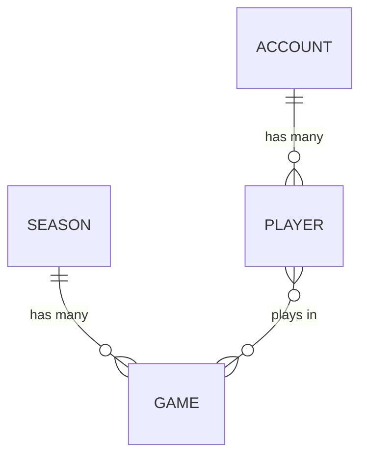

# stweak

Player account management for a theoretical online team PvP game.

stweak is the system of record for who a player is and what happened to them.
It owns accounts, the players attached to those accounts, the seasons the game
is divided into, and the games played within a season. It does not run matches
and it is not the game server; it is the book of record that sits behind one.

The project exists mostly to demonstrate a way of building software as to with
a real-life scenario. It is a research project for the author as much as a
potential example for others, and is being developed with the help of AI as a
way to speed up development.

Terms that may be unfamiliar, and terms used here in a particular sense, are
defined in the [glossary][glossary].

## Project status

Early. The guidelines and the domain model are being written down first, before
any code exists, so that the code has something to be held to.

## Architecture and practices

- **Written in Ruby.** Because it is an easy language to read.
- **Event sourcing wherever possible.** Changes are recorded as events rather
  than as updates to stored state.
- **Hexagonal architecture.** The domain sits at the centre and knows nothing
  about the technology around it.
- **A projection system.** Read models are built from the event log by a
  dedicated projection system, which is part of the project rather than
  something bolted on around it.
- **CQRS.** Writes go through commands and aggregates, reads come from
  projections, and the two are kept apart; see the
  [CQRS][cqrs] design decision.
- **Heavily unit tested, with mutation testing via mutant.** Line coverage is
  not the target. Mutation score is, because it measures whether the tests
  actually constrain behaviour.
- **Performant testing.** It is essential that our tests run quickly so that,
  as the project grows, we do not need workarounds like splitting tests across
  test runners which always raises new issues and problems. It is also
  important since mutation testing is a multiplier of unit test time so
  large increases in test time are particularly painful. Due to this we will
  make sure our unit tests are actual unit tests with all dependencies mocked.
- **Statically typed with Sorbet.** Signatures on everything the domain
  exposes, checked before the tests run.
- **Explicit requires, no autoloading.** Every dependency is loaded where it is
  used and nowhere else.
- **Heavily documented.** Both the what and the why.

These are not aspirations to be traded away when they become awkward. They are
the point of the project, and the awkward cases are the interesting ones.

These constraints bind the domain gem in `lib/`, which is what the project is
actually about. There the correctness bar — full coverage killed by mutation
testing, `typed: strict` on everything, explicit `require_relative` for every
dependency, a named type in place of a bare primitive — is held without
compromise. The app area in `app/` is a different thing: its adapters and
drivers exist to demonstrate the ports against real technology and to drive the
domain end to end, so they are integration and demonstration code rather than
the artifact, and are deliberately not held to the domain's bar. They may
`require` the gem by name, need not be `typed: strict`, and are not measured for
mutation coverage. Where a practice above reads as absolute, read it as a claim
about the domain unless it says otherwise; the reasoning is set out in the
[domain's bar binds the gem, not the app area][bar] design decision.

## Goal

Be as close to a perfect example project as possible for the practices defined
above.

"Perfect" does not mean feature complete or production hardened. It means that
someone reading this repository should be able to see each practice applied
honestly and consistently, without the compromises and half measures that
usually creep into a codebase under deadline. Where a practice is inconvenient,
the inconvenience should be worked through rather than skipped.

Beyond the practices named above, the project aims to follow good development
practice generally: the everyday habits that are not worth listing
individually but are worth getting right, from naming and error handling to
commit history and dependency management.

## Domain

The vocabulary below is the shared language of the project. It is worth using
these terms exactly, in code and in conversation, rather than inventing
synonyms for them.

- **Account** - a single registered person, and potentially a paying one. An
  Account can have many Players. The person behind an Account does not
  necessarily play the game themselves; think of a parent paying while their
  children play.
- **Player** - an individual player of the game, with their own login. A
  Player has many Games, and a Game has many Players.
- **Season** - an arbitrary grouping of games, usually time-based but not
  always. Player stats typically reset when a new season starts, though a
  little may carry forward, such as a skill level.
- **Game** - a single game in which teams of people play, and the outcome of
  that game. It is best thought of as a game result: it records what happened,
  not a fixture to be played. Games are created dynamically, by matchmaking, as
  is typical of online games, rather than scheduled in advance the way
  traditional sports fixtures are.
- **Team** - not a persistent thing. A team is simply the collection of Players
  on one side within a Game, and has no existence outside it.

Separating Account from Player is what makes the rest of the model work. The
Account is the person and the commercial relationship with them; a Player is a
presence in the game. One Account may hold several Players, and what is true of
one Player is not automatically true of the others.

The Player to Game relationship is what makes a Player's record season-scoped.
A Player reaches a Season only by way of the Games they played in, so the
question "how did this Player do in that Season?" is answered by their Games,
never by a number stored against them.

### Events, not state

There are no accrued stats. What is stored are events: game outcomes, and
Account and Player CRUD actions. Stats are a projection over those events.

This inverts the usual expectation, so it is worth being blunt about. The
system does not hold a win count that gets incremented. It holds the record of
every game that was played, and a win count is one of many answers that can be
derived from that record. History is never lost, any figure can be traced back
to the events that produced it, and a question nobody thought to ask at the
start can still be answered later by replaying what has always been there.

### Account and Player actions

Both Accounts and Players have the typical CRUD actions:

- **Create** - registering an Account, or adding a Player to one.
- **Read** - retrieving an Account or Player as it currently stands.
- **Update** - changing what is held about them, such as a display name or
  contact details.
- **Delete** - removing an Account or Player from active use.

Delete is worth pausing on, because in a system that never rewrites its log it
cannot mean what it usually means. Deleting is itself an event: the record of
the deletion joins everything that came before it, and what is deleted is the
thing's presence in the game rather than its history. Erasing the history is a
separate concern, handled by [crypto-shredding](#gdpr).

They also have the admin and moderation actions that running a game demands:

- **Warnings** - recorded against the Player, and usually the step before
  anything heavier.
- **Temporary bans** - suspension from play for a fixed period.
- **Permanent bans** - suspension with no end.
- **Communication restrictions** - muting chat or voice while leaving play
  itself alone, since most reports concern what was said rather than what was
  done.
- **Matchmaking restrictions** - keeping a Player out of ranked or competitive
  queues, whether as a penalty or to protect other players from them.
- **Forced renames** - clearing a display name that should not have been
  allowed.
- **Stat or rank adjustments** - undoing the effect of cheating or of a bug,
  where leaving the result standing would be unfair to everyone else.
- **Reversals** - lifting any of the above, whether on appeal or because it was
  applied in error.

That last one matters more than its size suggests. Moderation decisions get
overturned, and a system that can only apply penalties and not lift them is
incomplete. Under event sourcing a reversal is simply another event, so the
sequence of penalty, appeal and reversal survives intact rather than the
penalty quietly disappearing.

Moderation is a first-class part of the domain rather than an afterthought
bolted on later. It is also a natural outcome of event sourcing: the history of
what was done to an account, by whom, and in what order is exactly the record a
moderation system needs, and it comes directly from how everything else is
stored rather than from a separate audit log that has to be kept in step.

### GDPR

GDPR is supported via crypto-shredding. Encryption keys live in a table that is
**not** event sourced. Compliance (the right to erasure) is handled by deleting
the encryption key, which renders the associated events unreadable. The event
stream itself is never mutated.

Keys are held **per entity that owns personal data**: an Account has its own
key, and each Player will have one of their own. Erasure is therefore
granular: a single Player can be erased without touching the others on the
same Account, and erasing an Account means deleting the keys of every Player
it holds *and* its own key.

This resolves what looks at first like a direct contradiction. An event log is
append-only and never rewritten, while the right to erasure requires that
personal data can be destroyed on request. Crypto-shredding satisfies both by
moving the deletion somewhere else: personal data is written encrypted, the key
lives in mutable storage outside the log, and erasing the key erases the data
in every sense that matters while leaving the append-only guarantee intact.

## License

Copyright (C) 2026 Jeffrey Jones.

Released under the GNU Affero General Public License, version 3 or later. See
[LICENSE](LICENSE.md) for the full text. The AGPL is chosen deliberately: it
extends the GPL's obligations to software offered over a network, so a hosted
version of this project carries the same duty to share source as a distributed
one.

[glossary]: glossary.md
[cqrs]: design-decisions.md#cqrs
[bar]: design-decisions.md#the-domains-bar-binds-the-gem-not-the-app-area
